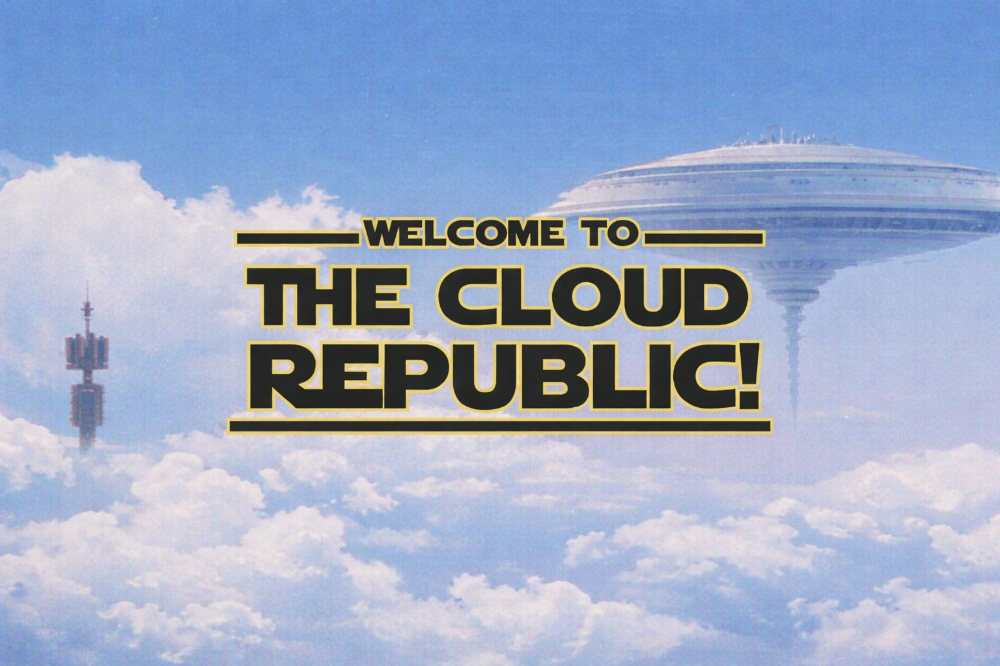

  

<!--  ## ☁️☁️☁️ Welcome to The Cloud Republic! ☁️☁️☁️ -->

Cloud & Infrastructure Engineer with 15+ years in enterprise IT. Experience in Azure, AWS, monitoring, incident handling, and CI/CD operations.

Currently transitioning into DevOps — building practical skills in Terraform, Python, Docker, and Kubernetes.

Sharing real projects and continuous learning through this GitHub.

🖥️ Cloud and Infrastructure specialist (Azure, AWS, GCP)  
🏠 Independent, reliable, active, flexible, and always learning  
💡 **Finished Projects:** [System Info Script](https://github.com/MartinTomcikMT/system-info-script) (python) , [Address Book Creator](https://github.com/MartinTomcikMT/address-book-creator) (python), [Cloud Devops Knowledge Base](https://github.com/MartinTomcikMT/cloud-devops-knowledge-base) (html,javascript), [Terraform Docker Infra - Phase3 ](https://github.com/MartinTomcikMT/terraform-docker-infra) (terraform)

<!--  -->

---

 

---

## 🛠️ Skills

---

## 📖 Currently Building With

---

## 📂 Projects in progress

### ☁️ Terraform

⭐ [Terraform Docker Infra](https://github.com/MartinTomcikMT/terraform-docker-infra) - IN PROGRESS  
Infrastructure as Code (IaC) project using Terraform to provision and manage a local Docker container.

➡️ **Phase 4 – Parameterization with tfvars**  
Introduce `terraform.tfvars` to allow easy customization:
- container name
- exposed port
- Docker image

➡️ **Phase 5 – Advanced Terraform Concepts**  
Enhance the project by:
- creating reusable modules
- deploying multiple containers

---

### 🐍 Python

[Python Learning Library](https://github.com/MartinTomcikMT/python-learning-library) - IN PROGRESS  
A structured Python learning repository where I organize my scripts by difficulty level — from fundamentals and beginner CLI scripts to system-focused automation and future advanced DevOps-related tooling.

➡️ **Fundamentals**  
Core syntax practice: variables, data types, conditions, loops, functions, lists, dictionaries, and input/output.

➡️ **Basic Scripts**  
Small beginner projects such as number guessing, dice rolling, calculators, file generators, and simple CLI tools.

➡️ **System-Focused Scripts**  
Practical scripts related to system information, files, folders, logs, and basic automation tasks.

➡️ **Intermediate**  
Modules, packages, reusable functions, error handling, file handling, JSON/CSV, and cleaner project structure.

➡️ **Advanced**  
APIs, databases, object-oriented programming, testing, logging, and more complex CLI applications.

➡️ **Expert / Future Goals**  
Cloud, Infrastructure, and DevOps-oriented Python automation scripts.
